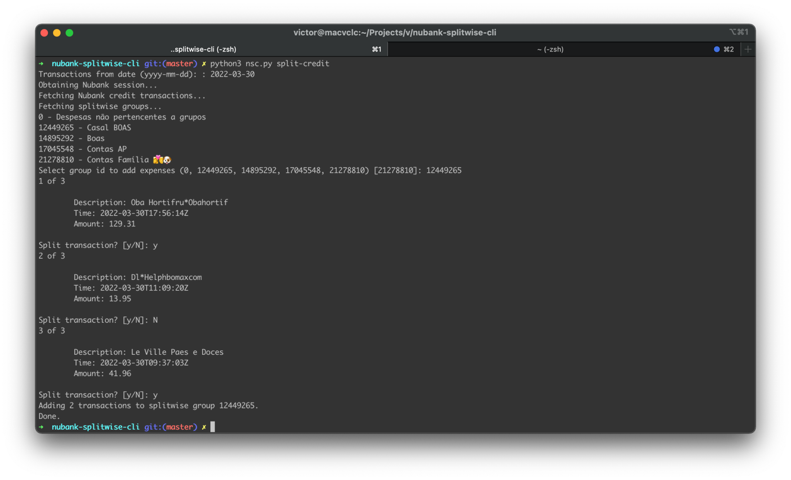

# Nubank to Splitwise Client

A quick way to register credit and debit transactions from Nubank into a group in Splitwise



## Getting Started

### Prerequisites

- python3

### Installation

1. Register an app and get an api key on [https://secure.splitwise.com/apps](https://secure.splitwise.com/apps)
2. Clone the repo
   ```sh
   git clone git@github.com:victorclc/nubank-splitwise-cli.git
   ```
3. Install python requirements
   ```sh
   pip3 install -r requirements.txt
   ```
4. Run pynubank and follow it instructions to create a .p12 certificate
   ```sh
   pynubank
   ```
5. Run nsc.py configure
    ```sh
   python3 nsc.py configure
   ```

<p align="right">(<a href="#top">back to top</a>)</p>

<!-- USAGE EXAMPLES -->

## Contributing

Contributions are what make the open source community such an amazing place to learn, inspire, and create. Any
contributions you make are **greatly appreciated**.

If you have a suggestion that would make this better, please fork the repo and create a pull request. You can also
simply open an issue with the tag "enhancement". Don't forget to give the project a star! Thanks again!

1. Fork the Project
2. Create your Feature Branch (`git checkout -b feature/AmazingFeature`)
3. Commit your Changes (`git commit -m 'Add some AmazingFeature'`)
4. Push to the Branch (`git push origin feature/AmazingFeature`)
5. Open a Pull Request

<p align="right">(<a href="#top">back to top</a>)</p>


<!-- LICENSE -->

## License

Distributed under the MIT License. See `LICENSE.txt` for more information.

<p align="right">(<a href="#top">back to top</a>)</p>


<!-- ACKNOWLEDGMENTS -->

